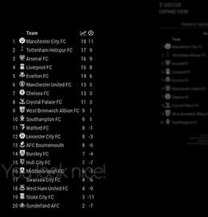

# MMM-soccer [](https://raw.githubusercontent.com/fewieden/MMM-soccer/master/LICENSE) [](https://travis-ci.org/fewieden/MMM-soccer) [](https://codeclimate.com/github/fewieden/MMM-soccer) [](https://snyk.io/test/github/fewieden/mmm-soccer)

European Soccer Standings Module for MagicMirror²

## Example

 


## Dependencies

* An installation of [MagicMirror²](https://github.com/MichMich/MagicMirror)
* OPTIONAL: [Voice Control](https://github.com/fewieden/MMM-voice)
* npm
* [request](https://www.npmjs.com/package/request)

## Installation

1. Clone this repo into `~/MagicMirror/modules` directory.
1. Configure your `~/MagicMirror/config/config.js`:

    ```
    {
        module: 'MMM-soccer',
        position: 'bottom_right',
        config: {
            ...
        }
    }
    ```

1. Run command `npm install` in `~/MagicMirror/modules/MMM-soccer` directory.
1. Optional: Get a free api key [here](http://api.football-data.org/register)

## Config Options

| **Option** | **Default** | **Description** |
| --- | --- | --- |
| `api_key` | false | Either false (limited to 50 requests a day) or an API Key obtained from <http://api.football-data.org/register> (limited to 50 requests a minute) . |
| `colored` | false | Boolean to show club logos in color or not. |
| `show` | 'GERMANY' | Which league should be displayed  'GERMANY', 'FRANCE', 'ENGLAND', 'SPAIN' or 'ITALY' |
| `focus_on` | false | Which team should the standings focus on per league e.g. {"GERMANY": "FC Bayern München", "FRANCE": "Olympique Lyonnais"}. Omit this option or set to false to show the full league table. |
| `max_teams` | false | How many teams should be displayed. Omit this option or set to false to show the full league table. |
| `leagues` | `{"GERMANY":430, "FRANCE": 434, "ENGLAND": 426, "SPAIN": 436, "ITALY": 438}` | A collection of leagues obtained from <http://api.football-data.org/v1/competitions> |
| `logos` | `false` | Boolean to show club logos or not. |

## Logos

As the v2 api doesn't provide logos anymore, I developed a club logo downloader. It supports the five major leagues as above named.
To run the downloader you need to execute the following steps.

1. Go to the module directory `cd ~/MagicMirror/modules/MMM-soccer`.
1. Execute `node scripts/downloader COUNTRYNAME`.
1. Run this command for all the leagues you want to display on the mirror.
1. Don't forget to activate the display of the logos in the config.

If there isn't every club logo, you can also place them manually in the public directory of the module,
the logos need to be in `svg` format and the name of the file has to match the displayed name.

## OPTIONAL: Voice Control

This module supports voice control by
[MMM-voice](https://github.com/fewieden/MMM-voice). In order to use this
feature, it's required to install the voice module. There are no extra config
options for voice control needed.

### Mode

The voice control mode for this module is `SOCCER`

### List of all Voice Commands

* OPEN HELP -> Shows the information from the readme here with mode and all commands.
* CLOSE HELP -> Hides the help information.
* SHOW STANDINGS OF COUNTRY NAME -> Switch standings to specific league.
  Valid country names are (Default: GERMANY, FRANCE, ENGLAND, SPAIN or ITALY)
  set in config. (Effect stays until your mirror restarts, for permanent change
  you have to edit the config)
* EXPAND VIEW -> Expands the standings table and shows all teams.
* COLLAPSE VIEW -> Collapse the expanded view.
