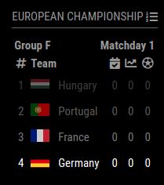
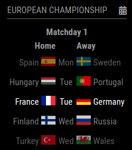
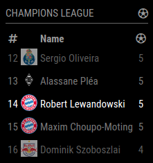
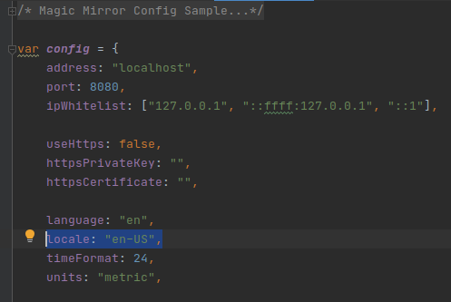

# MMM-soccer [](https://raw.githubusercontent.com/fewieden/MMM-soccer/master/LICENSE)  [](https://codeclimate.com/github/fewieden/MMM-soccer) [](https://snyk.io/test/github/fewieden/mmm-soccer) [](https://codecov.io/gh/fewieden/MMM-soccer)

European Soccer Standings Module for MagicMirror²

## Example

  

## Dependencies

* An installation of [MagicMirror²](https://github.com/MichMich/MagicMirror)
* npm
* [node-fetch](https://www.npmjs.com/package/node-fetch)
* [lodash](https://www.npmjs.com/package/lodash)

## Installation

* Clone this repo into `~/MagicMirror/modules` directory.
* Run command `npm i --production` in `~/MagicMirror/modules/MMM-soccer` directory.
* Configure your `~/MagicMirror/config/config.js` file. The config of this module can be complex for beginners. You can take a look at a [full example](#full-example) as reference.

## Global config

| **Option** | **Default** | **Description** |
| --- | --- | --- |
| `locale` | `undefined` | By default it is using your system settings. You can specify the locale in the global MagicMirror config. Possible values are for e.g.: `'en-US'` or `'de-DE'`. |

To set a global config you have to set the value in your config.js file inside the MagicMirror project.



## Config Options

| **Option** | **Default** | **Description** |
| --- | --- | --- |
| `colored` | `false` | Boolean to show club logos in color or not. |
| `logos` | `false` | Boolean to show club logos or not. |
| `rotationInterval` | `15000` (15 seconds) | How fast should the module rotate between the display types (standings, schedules and scorers). |
| `provider` | `{}` | Define the specific properties for each data provider that you want to use, see all [options](#provider). |
| `competitions` | `[]` | Define the competition list that you want to see on your mirror, see all [options](#competition-options). |

### Competition options

For each competition you have the following options.

| **Option** | **Default** | **Description** |
| --- | --- | --- |
| `code` | **`REQUIRED`** | Specify which competition it is, see all [supported competition codes](#competition-codes). |
| `standings` | `Not specified` | Specify the option that you want to use for this display type in this competition. Don't specify it, if you don't want this display type in this competition. See all [display type options](#display-type-options). |
| `schedules` | `Not specified` | Specify the option that you want to use for this display type in this competition. Don't specify it, if you don't want this display type in this competition. See all [display type options](#display-type-options). |
| `scorers` | `Not specified` | Specify the option that you want to use for this display type in this competition. Don't specify it, if you don't want this display type in this competition. See all [display type options](#display-type-options). |

#### Display type options

For each display type you have the following options.

| **Option** | **Default** | **Description** |
| --- | --- | --- |
| `provider` | **`REQUIRED`** | You have to specify which data provider you want to use for this display type in this competition, see all [supported provider](#provider). |
| `focusOn` | `Not specified` | Which team would you like to highlight? If no team is specified, it will show the top of the list. See all [possible team codes](#team-codes). |
| `maxEntries` | `Not specified` | How many entries should be displayed? It is recommended to specify a number to save space on your mirror. Omit this option to show the full list. |

### Competition codes

The list of currently available competitions and their codes.

| **Competition** | **Country** | **Code** |
| --- | --- | --- |
|1st Bundesliga|Germany|`BL1`|
|Premier League|England|`PL`|
|Serie A|Italy|`SA`|
|Ligue 1|France|`FL1`|
|La Liga|Spain|`PD`|
|Primeira Liga|Portugal|`PPL`|
|Eredivisie|Netherlands|`DED`|
|Serie A|Brazil|`BSA`|
|Championship|England|`ELC`|
|Champions League|International|`CL`|
|European Championship|International|`EC`|
|World Cup|International|`WC`|

### Team codes

The team codes are taken from two different sources. Make sure you pick the correct one for the team type of your competition.

#### Clubs

Find the list of team codes for clubs at [Reuters](https://liaison.reuters.com/tools/sports-team-codes)

#### Countries

Find the list of team codes for countries at [FIFA country code list](https://simple.wikipedia.org/wiki/List_of_FIFA_country_codes)

### Provider

The following data provider are integrated into the module:
- `football-data`

See their config options below.


#### football-data

| **Option** | **Default** | **Description** |
| --- | --- | --- |
| `apiKey` | **`REQUIRED`** | In order to use this data provider you have to obtain an API key. You can get them for free [here](http://api.football-data.org/register). |

### Full example

Don't forget to also configure the [global config object](#global-config).

```js
{
    module: 'MMM-soccer',
    position: 'top_right',
    config: {
        colored: true,
        logos: true,
        rotationInterval: 20 * 1000, // 20 seconds instead of 15 (default)
        provider: {
            'football-data': {
                apiKey: 'XXX' // Replace with your API key
            }
        },
        competitions: [
            {
                code: 'BL1', // 1st Bundesliga
                standings: {
                    provider: 'football-data', // Data provider to use
                    focusOn: 'SCF', // SC Freiburg
                    maxEntries: 5 // Display a maximum of 5 teams
                },
                scorers: {
                    provider: 'football-data',
                    focusOn: 'SCF',
                    maxEntries: 5
                }
            },
            {
                code: 'CL', // Champions league
                standings: {
                    provider: 'football-data',
                    focusOn: 'LIV', // Liverpool FC
                    maxEntries: 7
                },
                scorers: {
                    provider: 'football-data',
                    focusOn: 'BAY', // FC Bayern Munich
                    maxEntries: 5
                },
            },
            {
                code: 'EC', // European championship
                standings: {
                    provider: 'football-data',
                    focusOn: 'GER', // Germany
                    maxEntries: 5
                },
                schedules: {
                    provider: 'football-data',
                    focusOn: 'GER',
                    maxEntries: 5
                }
            },
        ]
    }
}
```

## Developer

* `npm run lint` - Lints JS and CSS files.
* `npm run docs` - Generates documentation.
