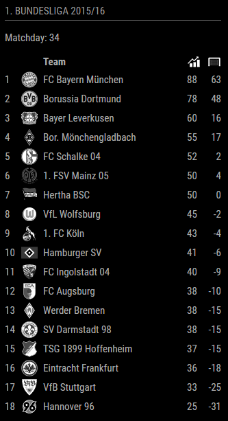
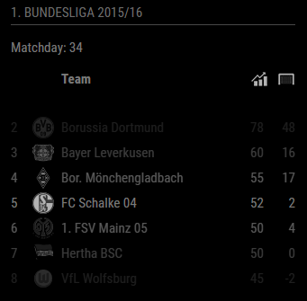

# MMM-soccer
European Soccer Standings Module for MagicMirror<sup>2</sup>

## Example

|  |  |

## Dependencies
  * An installation of [MagicMirror<sup>2</sup>](https://github.com/MichMich/MagicMirror)
  * npm
  * [request](https://www.npmjs.com/package/request)

## Installation
 1. Clone this repo into `~/MagicMirror/modules` directory.
 2. Configure your `~/MagicMirror/config/config.js`:

    ```
    {
        module: 'MMM-soccer',
        position: 'bottom_right',
        config: {
            ...
        }
    }
    ```
 3. Run command `npm install` in `~/MagicMirror/modules/MMM-soccer` directory.
 4. Optional: Get a free api key (here)[http://api.football-data.org/register]

## Config Options
| **Option** | **Default** | **Description** |
| --- | --- | --- |
| `api_key` | false | Either false (limited to 50 requests a day) or an API Key obtained from http://api.football-data.org/register (limited to 50 requests a minute) . |
| `show` | 'GERMANY' | Which league should be displayed  'GERMANY', 'FRANCE', 'ENGLAND', 'SPAIN' or 'ITALY' |
| `focus_on` | false | Which team should the standings focus on e.g. per league {"GERMANY": "FC Bayern München", "FRANCE": "Olympique Lyonnais"}. Omit this option or set to false to show the full league table. |
| `max_teams` | false | How many teams should be displayed. Omit this option or set to false to show the full league table. |
| `leagues` | `{"GERMANY":430, "FRANCE": 434, "ENGLAND": 426, "SPAIN": 436, "ITALY": 438}` | A collection of leagues obtained from http://api.football-data.org/v1/competitions |
